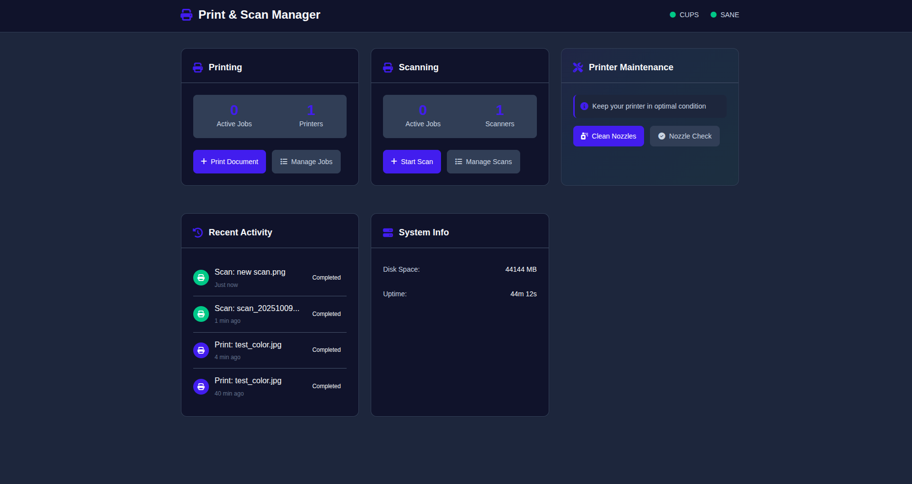
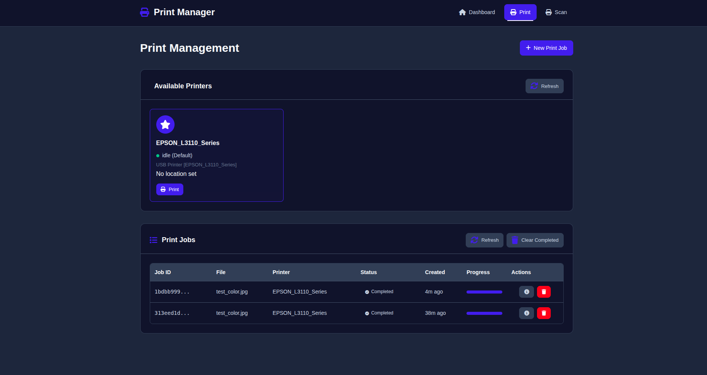

# Print & Scan Manager

<div align="center">


A modern web-based print and scan management system for Raspberry Pi, turning USB-only printers/scanners into WiFi-accessible devices.
Built with Rust and Actix-web, it offers a responsive interface for managing print jobs, scanning documents, and performing printer maintenance - all accessible from any device on your home network.

</div>

---

## Features

- **Print Management** - Upload and print PDF, DOC, DOCX, TXT, JPG, PNG with advanced options
- **Scan Management** - Scan at 150-1200 DPI, output to PDF, JPEG, PNG, or TIFF
- **System Control** - Monitor CUPS/SANE, printer maintenance, nozzle cleaning
- **Job History** - SQLite database for persistent storage
- **Web Interface** - Clean, responsive UI accessible from any device


## Tech Stack

- **Backend**: Rust + Actix-web
- **Database**: SQLite + sqlx
- **Frontend**: Vanilla JS, HTML5, CSS3
- **Integration**: CUPS, SANE, ESCPUTIL

## Screenshots

### Dashboard
 
*Main dashboard showing all key features: print, scan, maintenance, job queue, recent activity, and system info*

### Print Management

*Complete print job management*

### Scan Management

*Comprehensive scan interface*

## Quick Start

### Prerequisites

```bash
sudo apt update && sudo apt upgrade -y
sudo apt install -y cups cups-client sane sane-utils
curl --proto '=https' --tlsv1.2 -sSf https://sh.rustup.rs | sh
source $HOME/.cargo/env
```

### Printer Setup

1. Connect your printer via USB to the Raspberry Pi
2. Configure CUPS:
    ```bash
    # Add your user to the lpadmin group
    sudo usermod -aG lpadmin $USER
    
    # Access CUPS web interface at http://raspberry-pi-ip:631
    # Add and configure your printer
    ```

3. Configure SANE:
    ```bash
    # Test scanner detection
    scanimage -L
    
    # Verify scanner is detected
    sane-find-scanner
    ```

### Application Setup

1. Clone the repository:
    ```bash
    git clone https://github.com/bartlomiejbarszczak/web_printer.git
    cd web_printer
    ```

2. Build the application:
    ```bash
    cargo build --release
    ```

3. Run the application:
    ```bash
    ./target/release/web_printer
    ```

The application will be accessible at `http://raspberry-pi-ip:8080`

### Optional: Automated deploy on Raspberry PI with cross compile

1. Create a script (e.g., deploy_pi.sh)

2. Fill and add the following content
    ```bash
    #!/bin/bash
    PI_IP="<RaspberryPi IP address>"
    PI_USER="<PI username>"
    PROGRAM_NAME="web_printer"
    PI_DIRECTORY="Web" # or different directory name
    TARGET="aarch64-unknown-linux-gnu" # PI Zero 2W target
    
    echo "Cross-compiling for $TARGET..."
    cross build --target $TARGET --release
    
    echo "Copying executable to Pi..."
    scp target/$TARGET/release/$PROGRAM_NAME $PI_USER@$PI_IP:~/$PI_DIRECTORY
    
    echo "Copying static & templates files (css, images, js, html) to Pi..."
    scp -r static/ templates/ $PI_USER@$PI_IP:~/$PI_DIRECTORY
    
    echo "Setting executable permissions..."
    ssh $PI_USER@$PI_IP "chmod +x ~/$PI_DIRECTORY/$PROGRAM_NAME"
    
    echo "Done"
    ```
3. Make the script executable
4. Run docker
5. Run the script

### Optional: Run as System Service on Raspberry PI

1. Create a systemd service file:
    ```bash
    sudo nano /etc/systemd/system/print-scan-manager.service
    ```

2. Add the following content:
    ```ini
    [Unit]
    Description=Print & Scan Manager
    After=network.target cups.service
    
    [Service]
    Type=simple
    User=<PI username>
    WorkingDirectory=<Path to your working directory, example "/home/pi/Web">
    ExecStart=<Path to the execution file, example "/home/pi/Web/web_printer">
    Restart=always
    RestartSec=10
    
    [Install]
    WantedBy=multi-user.target
    ```

3. Enable and start the service:
    ```bash
    sudo systemctl daemon-reload
    sudo systemctl enable print-scan-manager
    sudo systemctl start print-scan-manager
    ```

## Usage

### Printing

1. Navigate to the **Print** page
2. Click **New Print Job**
3. Select your file (PDF, DOC, DOCX, TXT, JPG, PNG)
4. Configure options:
    - Printer selection
    - Number of copies
    - Page range (optional)
    - Duplex printing (if supported)
    - Color or monochrome mode
    - Paper size
5. Click **Start Printing**

### Scanning

1. Navigate to the **Scan** page
2. Click **New Scan**
3. Configure settings:
    - Scanner selection
    - Resolution (150-1200 DPI)
    - Output format (PDF, JPEG, PNG, TIFF)
    - Color mode
    - Brightness & contrast
    - Page size
4. Click **Start Scan**
5. Download or preview the scanned document once complete

### Printer Maintenance

From the dashboard:
- **Nozzle Check** - Prints a test pattern to verify nozzle condition
- **Clean Nozzles** - Performs a cleaning cycle to clear clogged nozzles

## Project Structure

```
print-scan-manager/
├── src/
│   ├── main.rs         # Application entry point
│   ├── database/       # SQLite setup
│   ├── handlers/       # HTTP handlers
│   ├── services/       # CUPS, SANE, ESCPUTIL integration
│   ├── models/         # Job models & queue
│   └── utils/          # Utilities
├── static/
│   ├── css/            # Stylesheets
│   └── js/             # Frontend JavaScript
├── templates/          # HTML templates
├── uploads/            # Temporary print file storage
├── scans/              # Scanned document storage
└── data/                SQLite database location
```

## API Endpoints

### Print Endpoints
- `GET /api/printers` - List available printers
- `POST /api/print` - Submit print job
- `GET /api/print/jobs` - List all print jobs
- `GET /api/print/jobs/{id}` - Get specific print job
- `POST /api/print/jobs/{id}` - Cancel print job
- `DELETE /api/print/jobs/{id}` - Delete print job record

### Scan Endpoints
- `GET /api/scanners` - List available scanners
- `POST /api/scan` - Start scan job
- `GET /api/scan/jobs` - List all scan jobs
- `GET /api/scan/jobs/{id}` - Get specific scan job
- `GET /api/scan/download/{id}` - Download scanned file
- `DELETE /api/scan/jobs/{id}` - Delete scan job record

### System Endpoints
- `GET /api/system/status` - Get system status
- `POST /api/system/nozzle/check` - Perform nozzle check
- `POST /api/system/nozzle/clean` - Clean printer nozzles

### Events Endpoints
- `GET /api/events/stream` - Subscribe to Server-Sent Events (SSE)
    - Streams real-time updates about job queue and system status
    - Event Types:
        - `queue_update`: Contains current job queue with currently processing
        - `status_update`: Contains system status info
        - `recent_activity_update`: Contains recently completed jobs with limit of 4

## Contributing

Contributions are welcome! Please feel free to submit a Pull Request.

1. Fork the repository
2. Create your feature branch (`git checkout -b feature/AmazingFeature`)
3. Commit your changes (`git commit -m 'Add some AmazingFeature'`)
4. Push to the branch (`git push origin feature/AmazingFeature`)
5. Open a Pull Request

## License

This project is licensed under the MIT License - see the [LICENSE](LICENSE) file for details.

## Acknowledgments

- Built with [Actix-web](https://actix.rs/) - Fast, pragmatic, Rust web framework
- [CUPS](https://www.cups.org/) - Common Unix Printing System
- [SANE](http://www.sane-project.org/) - Scanner Access Now Easy
- [SQLx](https://github.com/launchbadge/sqlx) - Rust SQL toolkit
- Inspired by the need for simple, accessible home printing solution
